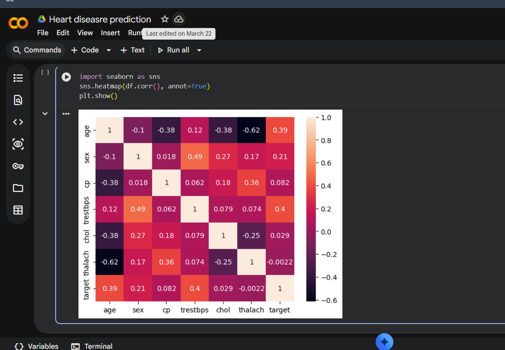

# heart-disease-prediction
This project aims to predict the likelihood of heart disease using machine learning algorithms. It uses medical and patient data such as age, cholesterol levels, and blood pressure to build predictive models. 
# 🤖 AI/ML Project

## 📌 Description
This project demonstrates the use of machine learning techniques to solve real-world problems using data.

## 🚀 Features
- Data preprocessing
- Model training
- Prediction system

## 🛠️ Technologies Used
- Python
- Pandas
- NumPy
- Scikit-learn

## ▶️ How to Run
1. Install required libraries
2. Run the Python file

## 📸 Output
(Add your output screenshot here)

