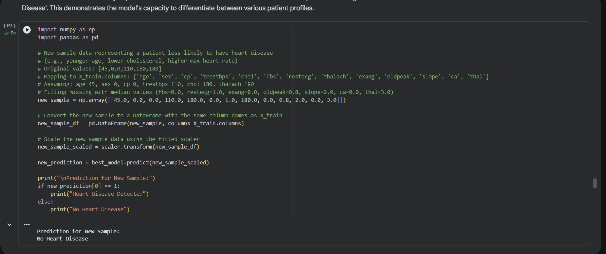

# ❤️ Heart Disease Prediction Web App

An end-to-end Machine Learning project that predicts the likelihood of heart disease using patient health data. Built with Python, Scikit-learn, and Streamlit.

---

# 🚀 Live Demo

🔗 Streamlit App:
🔗 Live App: https://heart-disease-prediction-bugvoundrhkv4bg4ev7q3h.streamlit.app/

```

  

---

# 📌 Project Overview

This project demonstrates a complete machine learning workflow including:

* Data preprocessing
* Exploratory Data Analysis (EDA)
* Feature engineering
* Model training and evaluation
* Model deployment using Streamlit

The web application allows users to enter medical details and receive instant heart disease predictions.

---

# 🛠️ Technologies Used

* Python
* Pandas
* NumPy
* Scikit-learn
* Streamlit
* Joblib
* Matplotlib

---

# 📂 Project Structure

```bash
├── heart_disease_prediction.ipynb
├── app.py
├── model.pkl
├── requirements.txt
├── dataset.csv
├── output.png
└── README.md
```

---

# ⚙️ Features

✅ Heart disease prediction system
✅ Interactive Streamlit web interface
✅ Real-time predictions
✅ Trained ML model integration
✅ Deployment-ready project structure

---

# 📊 Machine Learning Workflow

1. Data Collection
2. Data Cleaning
3. Feature Selection
4. Model Training
5. Model Evaluation
6. Model Saving using Joblib
7. Streamlit App Development
8. Deployment using Streamlit Community Cloud

---

# ▶️ Run Locally

Clone the repository:

```bash
git clone https://github.com/tarunibabu2006-tech/heart-disease-prediction
```

Install dependencies:

```bash
pip install -r requirements.txt
```

Run the application:

```bash
streamlit run app.py
```

---

# 📸 Application Preview



---

# 🌐 Deployment

This project is deployed using:

* GitHub
* Streamlit Community Cloud

---

# 👨‍💻 Author

Tarunika Babu

GitHub: https://github.com/tarunibabu2006-tech

---

# ⭐ Future Improvements

* Better UI/UX design
* API integration
* Cloud database support
* Mobile-friendly interface
* Advanced analytics dashboard
